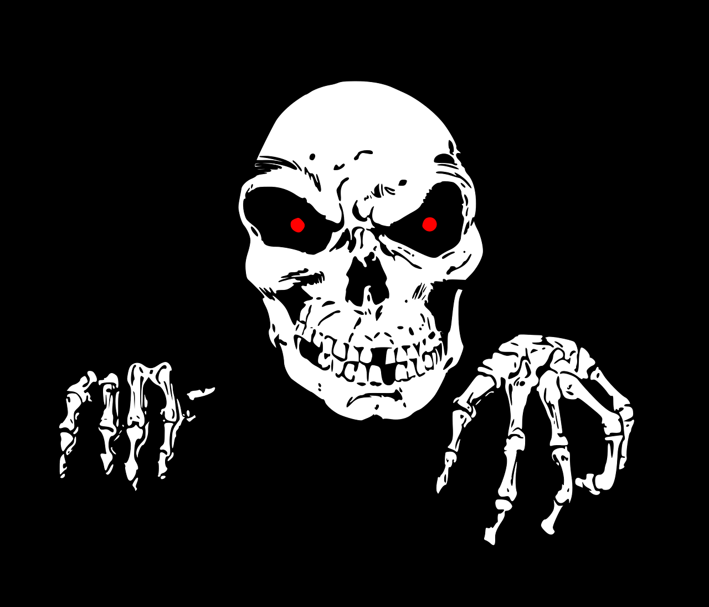

 # 🚀Portfolio développeur 24/25
 > HTML5 est la dernière révision majeure du HTML. Cette version a été finalisée le 28 octobre 2014. HTML5 spécifie deux syntaxes d'un modèle abstrait défini en termes de DOM : HTML5 et XHTML5. Le langage comprend également : une couche application avec de nombreuses 

 ```html


```

 
